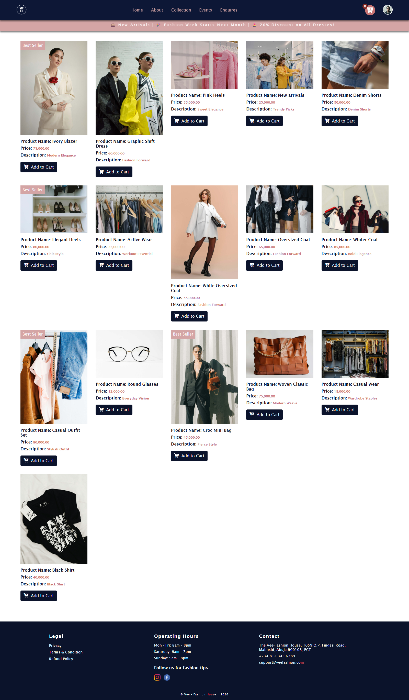
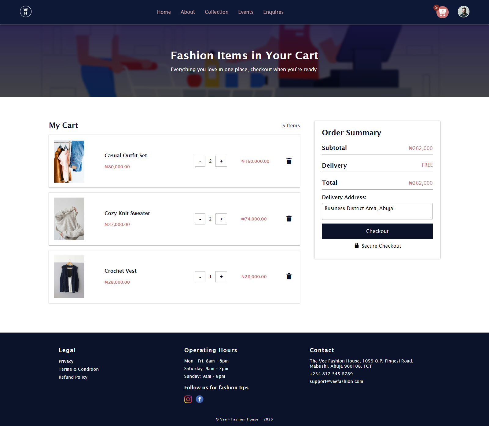
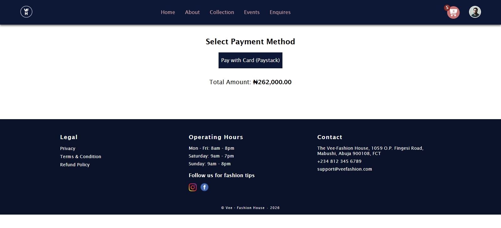
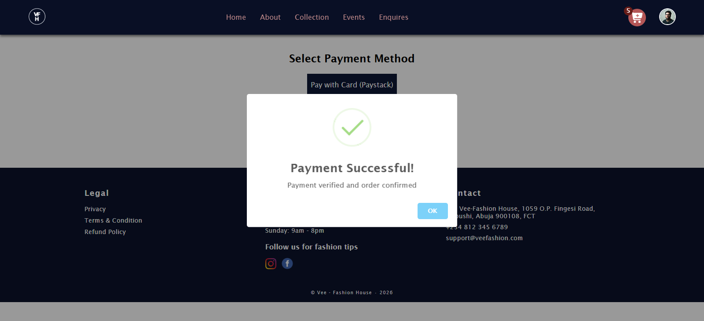
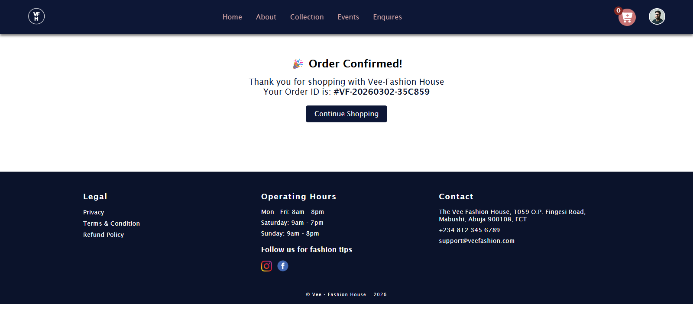
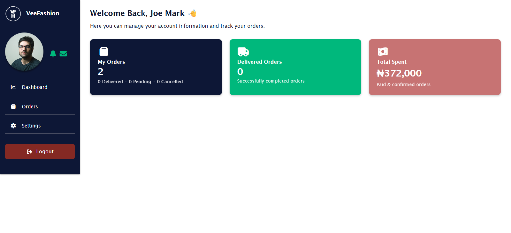
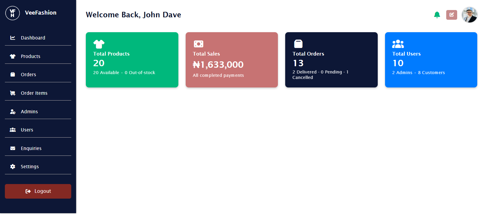

# 👗 Vee Fashion House — E-Commerce Platform

A full-stack fashion e-commerce web application built with PHP and MySQL featuring secure online payments using Paystack.

---

## 🚀 Features

- User authentication system
- Shopping cart & checkout
- Secure Paystack payment integration
- Order management system
- Admin dashboard
- Product inventory management
- Email order confirmation
- Session-based cart system
- Environment configuration (.env)

---

## 🛠 Tech Stack

- PHP (Core PHP)
- MySQL
- JavaScript / jQuery
- Paystack API
- PHPMailer
- HTML5 / CSS3

---

## 🔐 Security Features

- Server-side payment verification
- Prepared SQL statements
- Environment variable protection
- Session authentication

---

## 📸 Screenshots

### Homepage

### Product Gallery

### Cart System

### Payment Integration

### Order Placed

### User Dashboard

### Admin Panel

---

## ⚙️ Setup

1. Clone repo
2. Import database
3. Create `.env`
4. Configure database credentials
5. Run on local server

---

## 👨‍💻 Author

Built by: Olakanmi Michael Olayinka

